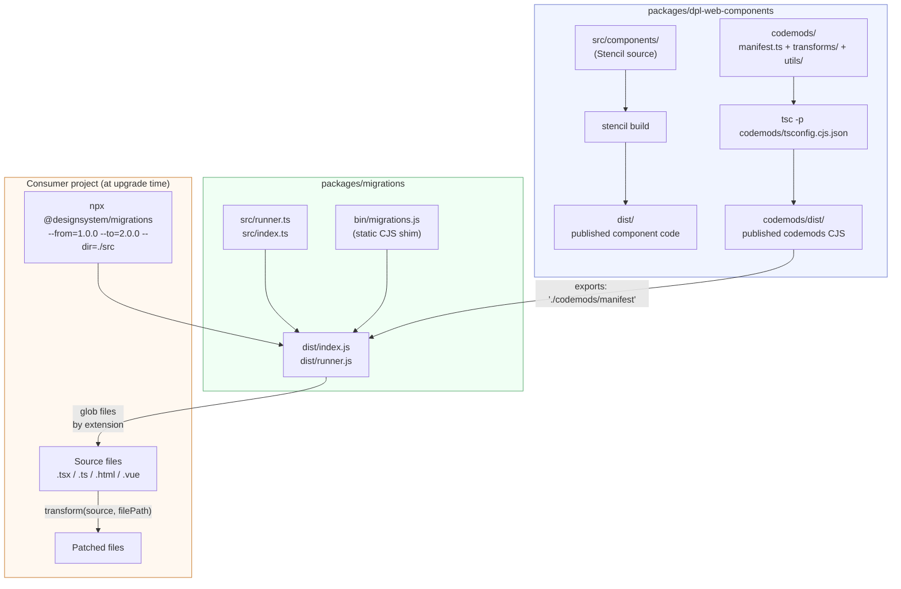
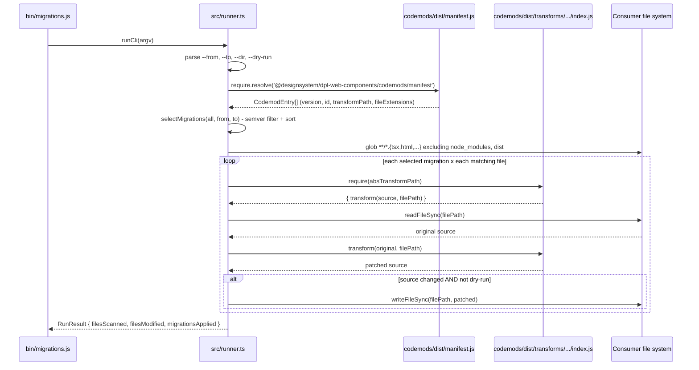

# Codemods - Interner Leitfaden fuer Entwickler

Automatisierte Migrations-Infrastruktur fuer `@designsystem/dpl-web-components`.
Dieses Dokument ist fuer Entwickler, die Codemods erstellen oder pflegen.
Wenn du die Migration nur ausfuehren willst, lies die README von `@designsystem/migrations`:
[`../../migrations/README.md`](../../migrations/README.md).

## Was liegt wo

- `packages/dpl-web-components/codemods/`: Manifest, einzelne Transforms, gemeinsame Utilities und Tests.
- `packages/migrations/`: CLI/Runtime, die Transforms findet und in einem Zielprojekt ausfuehrt.
- Die Codemods werden aus dem Web-Components-Paket veroeffentlicht. So kommt jede Migration mit der passenden Komponenten-Version.

---

## Registrierte Migrationen

| Version | ID | Dateitypen | Beschreibung |
| --- | --- | --- | --- |
| v2.0.0 | `rename-cell-type-icon-to-status` | ts, tsx, js, jsx, html, vue | Benennt `CellType`-Wert `icon` in `status` um |

---

## Validierung und Sicherheit

Alle Transforms werden vor der Veroeffentlichung geprueft. Ziele:

- **Korrektheit**: Noetige Funktionen werden korrekt exportiert
- **Sicherheit**: Kein kaputter Code und kein Datenverlust
- **Idempotenz**: Zwei Durchlaeufe liefern dasselbe Ergebnis
- **Vollstaendigkeit**: Test-Fixtures sind vorhanden und gueltig

Validierung ausfuehren:

```bash
# Zuerst bauen
nx run dpl-web-components:codemods:build

# Standard-Validierung (Warnungen sind erlaubt)
nx run dpl-web-components:codemods:validate

# Strikter Modus (Warnungen sind Fehler, fuer CI/CD)
nx run dpl-web-components:codemods:validate:strict
```

Mehr Details findest du in [VALIDATION.md](./VALIDATION.md).

---

## Architektur

Zwei Pakete arbeiten zusammen, damit Nutzer Codemods ausfuehren koennen:



### Wie Transforms zur Laufzeit gefunden werden



---

## Ordnerstruktur

```text
codemods/
├── README.md               <- du bist hier
├── manifest.ts             <- Versions-Registry: mappt semver auf Transform-Modul
├── jest.config.cjs         <- eigene Jest-Konfiguration (getrennt von Stencil-Tests)
├── tsconfig.cjs.json       <- kompiliert codemods/ -> codemods/dist/ (CommonJS, ohne __tests__)
├── cli.ts                  <- direkter Runner pro Transform (--transform <id> --dir <path>)
├── utils/
│   ├── common.ts           <- gemeinsame Helfer wie escapeRegExp()
│   ├── html.ts             <- Helfer fuer HTML/Vue-Templates
│   └── jsx.ts              <- AST-Helfer fuer JSX/TSX
└── transforms/
  └── v2.0.0/
    └── rename-cell-type-icon-to-status/
            ├── index.ts            <- transform(), transformJsx(), transformHtml()
            └── __tests__/
                └── index.test.ts   <- Unit-Tests (inline String-Fixtures)
```

**Namensregel:** `transforms/<vX.Y.Z>/<kebab-description>/`
Der Versionsordner ist die `dpl-web-components`-Version, ab der Nutzer diese Migration brauchen.

---

## Wie ein Transform funktioniert

Jeder Transform exportiert drei Funktionen:

```typescript
// Routing nach Dateiendung
export function transform(source: string, filePath: string): string

// AST-basiert via recast (fuer .ts, .tsx, .js, .jsx)
export function transformJsx(source: string): string

// Regex-basiert (fuer .html, .vue templates)
export function transformHtml(source: string): string
```

### JSX/TSX-Pfad - `replaceJsxStringAttr`

Nutzt `recast` mit `babel-ts` Parser. Der AST wird durchlaufen und statische `StringLiteral`-Werte werden ersetzt.
Auch passende String-Literale in `JSXExpressionContainer` werden ersetzt (z. B. `variant={"outline"}`).
Geaenderte Knoten werden mit `recast.types.builders.stringLiteral()` neu gebaut. Dadurch druckt recast nur geaenderte Teile neu und behaelt das restliche Formatting.

### HTML/Vue-Pfad - `replaceHtmlAttr`

Nutzt eine Regex-Strategie mit zwei Schritten:

1. **Aeussere Regex** findet das komplette oeffnende Tag der Ziel-Elemente (z. B. `<dpl-button ...>` oder `<dpl-button .../>`).
2. **Innere Regex** ersetzt den Ziel-Attributwert nur innerhalb dieses gefundenen Tags.

So bleibt die Ersetzung auf oeffnende Tags begrenzt. Textinhalt und andere Elemente werden nicht veraendert.
Dynamische Angular/Vue-Bindings werden auch unterstuetzt, aber nur fuer sichere String-Literal-Ersetzungen in `[attr]="..."` und `:attr="..."`.

---

## Neue Migration hinzufuegen

### 0. Generator nutzen (empfohlen)

Nutze den Nx-Generator, um Transform, Tests und Fixtures automatisch anzulegen:

```bash
nx generate @designsystem/dpl-web-components:transform \
  --name=your-migration-id \
  --version=X.Y.Z \
  --description="One-line description of what this transform does" \
  --extensions=tsx,html,vue
```

Das erzeugt:
- Transform unter `codemods/transforms/vX.Y.Z/your-migration-id/index.ts`
- Testdatei und Fixture-Vorlagen
- Automatische Registrierung im Manifest

Danach kannst du direkt mit Schritt 1 weitermachen (Tests schreiben).
Mehr Details: [tools/generators/README.md](../../tools/generators/README.md).

---

### 1. Transform erstellen (manuell)

Wenn du den Generator nicht nutzen willst:

```bash
mkdir -p codemods/transforms/vX.Y.Z/your-migration-id
touch codemods/transforms/vX.Y.Z/your-migration-id/index.ts
mkdir -p codemods/transforms/vX.Y.Z/your-migration-id/__tests__
touch codemods/transforms/vX.Y.Z/your-migration-id/__tests__/index.test.ts
```

**`index.ts`-Grundgeruest:**

```typescript
import { replaceJsxStringAttr } from '../../../utils/jsx';
import { replaceHtmlAttr } from '../../../utils/html';

const TARGET_TAGS = ['dpl-my-component', 'DplMyComponent'];
const ATTR_NAME = 'old-prop';
const FROM_VALUE = 'old-value';
const TO_VALUE = 'new-value';

export function transformJsx(source: string): string {
  return replaceJsxStringAttr(source, TARGET_TAGS, ATTR_NAME, FROM_VALUE, TO_VALUE);
}

export function transformHtml(source: string): string {
  return replaceHtmlAttr(source, TARGET_TAGS, ATTR_NAME, FROM_VALUE, TO_VALUE);
}

export function transform(source: string, filePath: string): string {
  if (/\.[jt]sx?$/.test(filePath)) return transformJsx(source);
  if (/\.(html|vue)$/.test(filePath)) return transformHtml(source);
  return source;
}
```

### 2. Tests schreiben

Noetige Testfaelle, bevor ein Transform produktionsreif ist:

| Fall | Warum |
| --- | --- |
| Haupt-Transformation | Zeigt, dass der Codemod das Ziel erreicht |
| Bereits migrierte Eingabe (Idempotenz) | Zweiter Lauf darf nichts kaputt machen |
| Dynamische Bindings (JSX / Angular / Vue) | Nur sichere Literal-/Key-Ersetzungen, keine Laufzeit-Referenzen |
| Anderes Component mit gleichem Attribut | Muss auf Ziel-Elemente begrenzt sein |
| Mehrere Treffer in einer Datei | Alle Stellen muessen angepasst werden |
| HTML/Template-Variante | Falls relevant, fuer Angular/Vue |

### 3. In `manifest.ts` registrieren

```typescript
{
  version: 'X.Y.Z',
  id: 'your-migration-id',
  description: 'One-line description shown in CLI output.',
  fileExtensions: ['tsx', 'jsx', 'ts', 'js', 'html', 'vue'],
  transformPath: './transforms/vX.Y.Z/your-migration-id/index',
  developerHint: 'Optional: Message for developers about manual follow-up steps required.',
}
```

`transformPath` ist relativ zur Manifest-Datei.
Nach `tsc` liegen Manifest und Transforms beide in `codemods/dist/`, deshalb bleibt der relative Pfad gleich.

**Optional: `developerHint`** — Falls dein Transform automatisiert nicht alles loesen kann (z. B. dynamische Werte, Stilfein-Tuning, oder komplexe Migrationen), nutze das Feld `developerHint` um Entwicklern mitzuteilen, was sie manuell ueberpruefen muessen.

Beispiel:
```typescript
developerHint: 'Manual review required: Color defaults to "gray". Verify each cell and adjust to "yellow"/"green"/"red"/"blue" as needed.'
```

Wenn der Transform Dateien aendert, wird die Nachricht:
- **Bei CLI-Ausfuehrung** als `⚠️ ` (gelbe Warnung) angezeigt
- **Im JSON-Output** unter dem Feld `developerHint` des Ergebnisses enthalten
- **In der Migrations-CLI** werden nur Hints fuer Migrations mit Aenderungen angezeigt

### 4. Bauen und testen

```bash
# Type-check und kompilieren
nx run dpl-web-components:codemods:build

# Tests ausfuehren
nx run dpl-web-components:codemods:test

# Smoke-Test auf echtem Ordner (dry-run)
nx run dpl-web-components:codemods:run -- \
  --transform your-migration-id \
  --dir ../../apps/angular-demo/src \
  --dry-run
```

---

## Build-Pipeline

| Schritt | Befehl | Ergebnis |
| --- | --- | --- |
| Codemods nach CJS kompilieren | `nx run dpl-web-components:codemods:build` | `codemods/dist/` |
| Codemod-Tests ausfuehren | `nx run dpl-web-components:codemods:test` | (haengt von Build ab) |
| **Transforms validieren** | `nx run dpl-web-components:codemods:validate` | (haengt von Build ab) |
| **Strikte Validierung (CI/CD)** | `nx run dpl-web-components:codemods:validate:strict` | (schlaegt bei Warnungen fehl) |
| Transform direkt ausfuehren | `nx run dpl-web-components:codemods:run -- --transform <id> --dir <path>` | Geaenderte Dateien |
| Migrations-CLI bauen | `nx run migrations:build` | `packages/migrations/dist/` |
| Migrations-CLI-Tests ausfuehren | `nx run migrations:test` | - |

Der Ordner `codemods/dist/` ist in `dpl-web-components/package.json` unter `files` enthalten und wird ueber `./codemods/manifest` exportiert. So kann die `@designsystem/migrations` CLI das kompilierte Manifest und die Transforms nach `npm install` laden.

### Validierungsschritt

Vor der Veroeffentlichung ausfuehren:

```bash
# Codemods bauen
nx run dpl-web-components:codemods:build

# Tests ausfuehren
nx run dpl-web-components:codemods:test

# Validieren (Warnungen erlaubt)
nx run dpl-web-components:codemods:validate

# Strikt fuer CI/CD (Warnungen sind Fehler)
nx run dpl-web-components:codemods:validate:strict
```

Validatoren pruefen:
- Manifest-Gueltigkeit
- Transform-Exports und Signaturen
- Vollstaendige Fixtures
- Idempotenz
- Sicherheit (kein kaputter Code / Datenverlust)

Siehe [VALIDATION.md](./VALIDATION.md) fuer alle Details.

---

## Sicherheitsleitlinien

- **Konservativ bleiben.** Nur aendern, was statisch als Literal sicher erkannt wird.
- **Idempotenz einhalten.** `transform(transform(source)) === transform(source)` muss gelten.
- **Dynamische Bindings nur vorsichtig.** Nur sichere Literal-/Key-Muster umschreiben, unsichere Ausdruecke unberuehrt lassen.
- **Scoped Matching.** Regex-Transforms nur in oeffnenden Tags anwenden, nicht in Text, Kommentaren oder schliessenden Tags.
- **No-op zuerst testen.** Wenn No-op-Tests fehlschlagen, ist das Matching zu breit.
- **Formatting bewahren.** Fuer JS/TS/JSX `recast` nutzen, keine Komplett-Ersetzung der Datei.
- **Eine Aufgabe pro Transform.** Nicht mehrere unzusammenhaengende Migrationen in einer Datei mischen.
